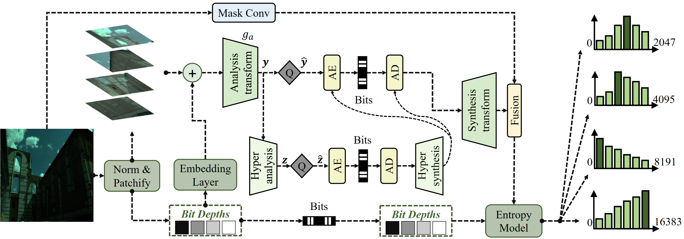
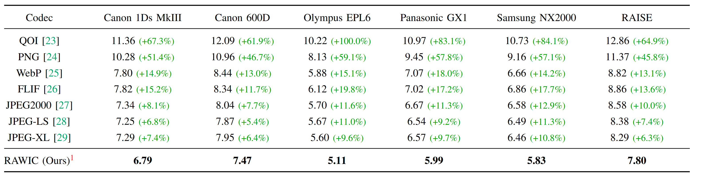
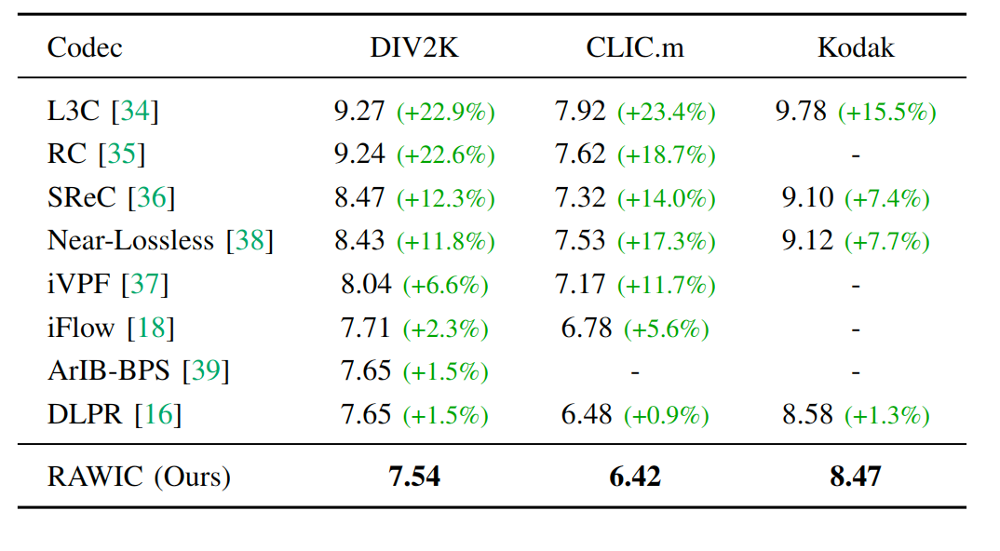
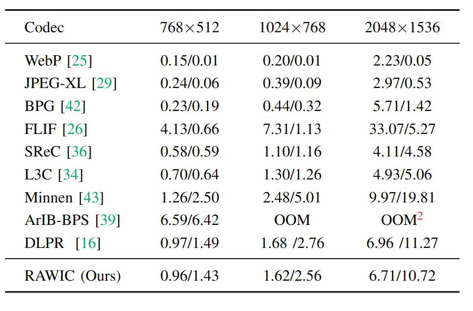

# RAWIC: Bit-Depth Adaptive Lossless Raw Image Compression
This repo is the official implementation of the paper "RAWIC: Bit-Depth Adaptive Lossless Raw Image Compression" (ICME 2026).
<div align="center">
  
  <p>Figure 1: The proposed pipeline of our model.</p>
</div>


<div align="center">
  
  <p>Figure 2: The performance of RAWIC for raw image compression.</p>
</div>


<table align="center">
  <tr>
    <td align="center">
      
      <br />
      <sub>(a) RGB Compression Performance</sub>
    </td>
    <td align="center">
      
      <br />
      <sub>(b) RGB Compression Runtime</sub>
    </td>
  </tr>
</table>


## Preparation

A suitable conda environment named rawic can be created and activated by:
```
conda create -n rawic python=3.10.18
conda activate rawic
pip install -r requirements.txt
```


### Dataset
Download the [NUS8](https://yorkucvil.github.io/projects/public_html/illuminant/illuminant.html) including Canon 1Ds MkIII, Canon 600D, Olympus EPL6, Panasonic GX1, and Samsung NX2000, and [RAISE](https://loki.disi.unitn.it/RAISE/) dataset. Then, use the scripts to preprocess the datasets
```
python cal_dataset_pure.py # for NUS8 you may need to change the path in the code
python cal_dataset_raise.py # for RAISE you may need to change the path in the code
``` 
You can also check the properties of the datasets by running, this will generate two excel files in `./` containing the statistics of the datasets
```
python cal_dataset_pure.py
python cal_dataset_raise.py
```

## Usage

### Config descriptions
The training and evaluation configurations are located in the `configs` folder. We provide the following configuration files:

* **Full RAW** — `raw_jpegcond_all_mask1.py`: Trained on the NUS8 and RAISE datasets; corresponds to Table I in the paper.
* **Full RGB** — `rgb_channel_ctx_part4_bd.py`: Trained on the DIV2K dataset; corresponds to Table II in the paper.
* **Ablation (Fixed Bit-Depth)** — `raw_jpegcond_all_mask1_wobd.py`: Trained on the NUS8 and RAISE datasets without bit-depth adaptation; corresponds to Table V in the paper.
* **Ablation (Camera-Specific)** — `raw_jpegcond_all_{camera}_mask1.py`: Trained on the NUS8 and RAISE datasets with camera-specific settings; corresponds to Table VI in the paper.


### Pre-trained models
We provide main models and ablation models. You can download from [PKU Disk](https://disk.pku.edu.cn/link/AACF89B6C4E991420B9FF93197230EA21D), [BaiDu NetDisk](https://pan.baidu.com/s/1AAnWaZOj48rgiBRKgRWtoA?pwd=4zue), or [Google Drive](https://drive.google.com/drive/folders/16OZmQ-8sUAX9KYj35kze2KkvHOSqVP0Z?usp=sharing)


| Configuration | MD5 Checksum |
| :--- | :--- |
| `raw_jpegcond_all_mask1` | `afa41b8807883dce4912cc75dc8be4a0` |
| `raw_jpegcond_Canon1DsMkIII_mask1` | `c621fae81c97c972ec7a9d5ea91f4a02` |
| `raw_jpegcond_Canon600D_mask1` | `1d1d18db22f1d78ac7aea226d3305d06` |
| `raw_jpegcond_OlympusEPL6_mask1` | `9d4249204700da0571711ef3f6c20eeb` |
| `raw_jpegcond_PanasonicGX1_mask1` | `b9bfb3e21bf13f06f396f56201424591` |
| `raw_jpegcond_SamsungNX2000_mask1` | `0806ea24ebda5797a75e7860e2b27992` |
| `raw_jpegcond_RAISE_mask1` | `f01e71e22c4ed0ec096ddda6fcccaf1e` |
| `raw_jpegcond_all_mask1_wobd` | `4e6f84b30c8f7f3222dc566593709782` |
| `rgb_channel_ctx_part4_bd` | `f4b14a04ae71758750ab66b880d22723` |


### Training from scratch

Example script for training the model from scratch, it takes about 1 day on a single NVIDIA A100 GPU:

```
python train.py --config raw_jpegcond_all_mask1.py # for raws
python train.py --config rgb_channel_ctx_part4_bd.py # for rgbs
```

### Evaluation
Given a model checkpoint, you can evaluate the negative log-likelihood (NLL) by dry-run (recommended)
```
python eval_comp.py --ckpt <path_to_ckpt> --config <path_to_config> --dryrun # for raw
python eval_rgb_torchac.py --ckpt <path_to_ckpt> --config <path_to_config> --dryrun # for rgb
```
or evaluate the actual bpp and runtime of compressing and decompressing the images:
```
python eval_comp.py --ckpt <path_to_ckpt> --config <path_to_config> # for raw
python eval_rgb_torchac.py --ckpt <path_to_ckpt> --config <path_to_config> # for rgb
```
You can evaluate on multiple directories by specifying `--imgdir` multiple times:
```
python eval_comp.py --ckpt <path_to_ckpt> --config <path_to_config> --imgdir <path_to_imgdir1> <path_to_imgdir2>
```


We also provide a script to evaluate the traditional codecs for RAW images built on `imagecodecs` and `rawpy`:
```
python tra_codec_raw.py --imgdir <path_to_imgdir1> <path_to_imgdir2>
```


## CUDA accelerated arithmetic codec
We adapted the arithmetic coding from [FCGS](https://github.com/YihangChen-ee/FCGS). Since the original version does not support high bit-depth encoding, we have implemented several modifications. For details, please refer to [arithmetic_v2](./arithmetic_v2/).


## Citation

Coming soon.


## Acknowledgment

This code is built on top of [CompressAI](https://github.com/InterDigitalInc/CompressAI). This repo refers the nn modules from [DLPR](https://github.com/BYchao100/Deep-Lossy-Plus-Residual-Coding), entropy coding from [torchac](https://github.com/fab-jul/torchac) and CUDA accelerated arithmetic codec from [arithmetic_coding](https://github.com/YihangChen-ee/FCGS).